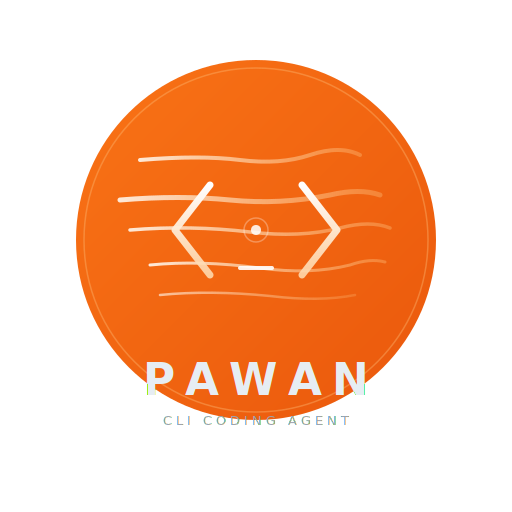

<p align="center">
  
</p>

<h1 align="center">पवन — pawan</h1>

<p align="center">
  <strong>A Rust runtime for vibe coding and agentic engineering.</strong><br>
  Self-healing CLI coding agent with AST + LSP powers. Runs on your hardware.<br>
  No subscription. No telemetry. No vendor lock-in.
</p>

<p align="center">
  <a href="LICENSE"></a>
  
</p>

---

Pawan reads, writes, and heals code. It has a tool-calling loop, streaming TUI, git integration, AST-level code rewriting, and works with any OpenAI-compatible API — NVIDIA NIM, MLX, Ollama, or your own endpoint.

Built by [DIRMACS](https://dirmacs.com). Named after [Power Star Pawan Kalyan](https://en.wikipedia.org/wiki/Pawan_Kalyan) — martial artist, Telugu cinema icon, Deputy CM of Andhra Pradesh. That energy: raw power, cult following, fearless execution.

## Why Rust for vibe coding & agentic engineering

Vibe coding is *describe, ship, don't think about it*. Agentic engineering is the same loop with the model holding the tools. Both share a failure mode: the language. In a language where the LLM can bluff, sloppy output slips through and rots in production. Rust does not let the LLM bluff. The borrow checker, the type system, and `cargo check` are a deterministic auditor running at the speed of a compiler — every line the model emits is adversarially reviewed before it can run.

Pawan is built to take advantage of that loop:

- **Compile-gated confidence** — after every `.rs` write, pawan runs `cargo check` and feeds the errors back to the model. The model can't leave the turn until the code compiles.
- **AST-level rewrites via ast-grep** — structural find/replace over tree-sitter parse trees, not regex. When the model asks for "replace all `.unwrap()` with `?`", it actually happens correctly everywhere, including inside macros and nested expressions.
- **LSP-backed navigation** — go-to-definition, references, hover — the same signal your editor uses, piped into the model's context.
- **Self-healing loop** — `pawan heal` reads the current compile errors, generates a fix, applies it, re-checks, repeats until green.
- **No vendor lock-in** — runs against NVIDIA NIM, local MLX, Ollama, or any OpenAI-compatible endpoint. Bring your own model.

The thesis: the faster the vibe / agentic engineering loop runs, the more important the compiler becomes. Pawan is the runtime that makes Rust's compiler part of the agent loop.

## Install

```bash
cargo install pawan

# Or from source
git clone https://github.com/dirmacs/pawan && cd pawan
cargo install --path crates/pawan-cli
```

```bash
# NVIDIA NIM (free tier)
export NVIDIA_API_KEY=nvapi-...
pawan

# Local MLX on Mac (no key needed, $0 inference)
# Start mlx_lm.server, then:
PAWAN_PROVIDER=mlx pawan

# Local Ollama
PAWAN_PROVIDER=ollama PAWAN_MODEL=llama3.2 pawan
```

## What it does

```bash
pawan                  # interactive TUI with streaming markdown
pawan heal             # auto-fix compilation errors, warnings, test failures
pawan task "..."       # execute a coding task
pawan commit -a        # AI-generated commit messages
pawan review           # AI code review of current changes
pawan test --fix       # run tests, AI-analyze and fix failures
pawan explain src/x.rs # explain code
pawan run "prompt"     # headless single-prompt (for scripting)
pawan watch -i 10      # poll cargo check, auto-heal on errors
pawan tasks ready      # show actionable unblocked beads
pawan doctor           # diagnose setup issues
```

## Tools (29)

| Category | Tools |
|----------|-------|
| **File** | read, write, edit (anchor-mode + string-replace), insert_after, append, list_directory |
| **Search** | glob, grep, ripgrep (native rg), fd (native) |
| **Code Intelligence** | **ast_grep** — AST-level structural search and rewrite via tree-sitter |
| **Shell** | bash, sd (find-replace), mise (runtime manager), zoxide |
| **Git** | status, diff, add, commit, log, blame, branch, checkout, stash |
| **Agent** | spawn_agent, spawn_agents (parallel sub-agents) |
| **MCP** | Dynamic tool discovery from any MCP server |

### ast-grep — structural code manipulation

```bash
# Find all unwrap() calls across the codebase
ast_grep(action="search", pattern="$EXPR.unwrap()", lang="rust", path="src/")

# Replace them with ? operator in one shot
ast_grep(action="rewrite", pattern="$EXPR.unwrap()", rewrite="$EXPR?", lang="rust", path="src/")
```

Matches by syntax tree structure, not text. `$VAR` for single-node wildcards, `$$$VAR` for variadic.

## Architecture

```
pawan/
  crates/
    pawan-core/    # library — agent engine, 29 tools, config, healing
    pawan-cli/     # binary — CLI + ratatui TUI + AI workflows
    pawan-web/     # HTTP API — Axum SSE server (port 3300)
    pawan-mcp/     # MCP client (rmcp 0.12, stdio transport)
    pawan-aegis/   # aegis config resolution
  grind/           # autonomous data structure workspace
```

### Safety & intelligence features

- **Compile-gated confidence** — auto-runs `cargo check` after writing `.rs` files, injects errors back for self-correction
- **Path normalization** — detects and corrects double workspace prefix bug in all file tools
- **Token budget tracking** — separates thinking tokens from action tokens per call, visible in TUI (`think:130 act:270`)
- **Iteration budget awareness** — warns model when 3 tool iterations remain
- **Think-token stripping** — strips `<think>...</think>` from content and tool arguments

### TUI (v0.3.0)

- **Welcome screen** — model, version, workspace on first launch. Press any key to dismiss.
- **Command palette** (`Ctrl+P`) — fuzzy-searchable slash commands with model presets
- **F1 help overlay** — keyboard shortcuts reference, organized by category
- **Split layout** — activity panel slides in during processing (72/28 split)
- **Slash commands** — `/model`, `/search`, `/heal`, `/export`, `/tools`, `/clear`, `/quit`, `/help`
- **Message timestamps** — relative time (now, 5s, 2m, 1h) on each message
- **Scroll position** — `[2/5]` indicator in messages title bar
- **Session stats** — tool calls, files edited, message count in status bar
- **Conversation export** — `/export [path]` saves to markdown with tool call details
- **Dynamic input** — auto-resizes 3-10 lines based on content
- **Streaming markdown** — bold, code, italic, headers, lists rendered in real-time
- **vim-like navigation** — `j/k`, `g/G`, `Ctrl+U/D`, `/search`, `n/N`

### Intelligence (2026-04-08)

**Qwen3.5 122B A10B** — primary model. 383ms latency, 13.6s task completion, solid tool calling. MiniMax M2.5 (SWE 80.2%) as cloud fallback. 12 NIM models benchmarked.

**Multi-model thinking** — per-model thinking mode: Qwen/GLM (`chat_template_kwargs`), Mistral Small 4 (`reasoning_effort`), Gemma (`enable_thinking`), DeepSeek (`thinking`).

**ast-grep + LSP** — AST-level code search/rewrite + rust-analyzer powered intelligence. Structural refactors in one tool call.

**Token budget** — `reasoning_tokens` / `action_tokens` tracked per call. `thinking_budget` config caps thinking. TUI shows `think:N act:N` split.

**Auto-install + tiered registry** — missing CLI tools auto-install via mise. 29 tools in 3 tiers (Core/Standard/Extended).

## Configuration

Priority: CLI flags > env vars > `pawan.toml` > `~/.config/pawan/pawan.toml` > defaults

```bash
PAWAN_PROVIDER=nvidia           # nvidia | ollama | openai | mlx
PAWAN_MODEL=qwen/qwen3.5-122b-a10b
PAWAN_TEMPERATURE=0.6
PAWAN_MAX_TOKENS=4096
NVIDIA_API_KEY=nvapi-...
```

```toml
# pawan.toml
provider = "nvidia"
model = "qwen/qwen3.5-122b-a10b"
temperature = 0.6
max_tokens = 4096
max_tool_iterations = 20
thinking_budget = 0

[cloud]
provider = "nvidia"
model = "minimaxai/minimax-m2.5"

[eruka]
enabled = true
url = "http://localhost:8081"

[mcp.daedra]
command = "daedra"
args = ["serve", "--transport", "stdio", "--quiet"]
```

## Hybrid routing

Pawan supports local-first inference with cloud fallback:

1. **Local** (primary) — MLX on Mac M4 / Ollama / llama.cpp — $0/token
2. **Cloud** (fallback) — NVIDIA NIM MiniMax M2.5 — automatic failover when local is down

Zero-cost local inference with cloud reliability as a safety net.

## Model triage (12 NIM models tested, 2026-04-08)

| Model | Latency | Task Time | Notes |
|-------|---------|-----------|-------|
| **Qwen3.5 122B A10B** | 383ms | **13.6s** | Primary. Fastest task completion, solid tool calling. S tier. |
| **MiniMax M2.5** | 374ms | 73.8s | Cloud fallback. SWE 80.2% — best quality analysis. |
| Step 3.5 Flash | 379ms | — | S+ tier but empty responses in dogfooding. |
| Mistral Small 4 119B | 341ms | error | Eruka context injection triggers 400. |

Full triage: [dirmacs.github.io/pawan/triage/](https://dirmacs.github.io/pawan/triage/)

## Ecosystem

| Project | What |
|---------|------|
| [ares](https://github.com/dirmacs/ares) | Agentic retrieval-enhanced server (RAG, embeddings, multi-provider LLM) |
| [eruka](https://eruka.dirmacs.com) | Context intelligence engine (knowledge graph, memory tiers, decay) |
| [aegis](https://github.com/dirmacs/aegis) | Config management + WireGuard mesh overlay (aegis-net) |
| [doltclaw](https://github.com/dirmacs/doltclaw) | Minimal Rust agent runtime |
| [nimakai](https://github.com/dirmacs/nimakai) | NIM model latency benchmarker (Nim) |
| [daedra](https://dirmacs.github.io/daedra) | Self-contained web search MCP server (7 backends, automatic fallback) |

## License

MIT
