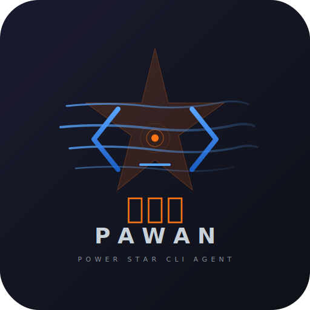

<p align="center">
  
</p>

<h1 align="center">पवन — pawan</h1>

<p align="center">
  <strong>A Rust runtime for vibe coding and agentic engineering.</strong><br>
  Self-healing CLI coding agent with AST + LSP powers. Runs on your hardware.<br>
  MIT licensed. BYO inference endpoint. Zero telemetry.
</p>

<p align="center">
  <a href="LICENSE"></a>
  
</p>

---

Pawan reads, writes, and heals code. It has a tool-calling loop, streaming TUI, git integration, AST-level code rewriting, and works with any OpenAI-compatible API — NVIDIA NIM, MLX, Ollama, or your own endpoint.

Built by [DIRMACS](https://dirmacs.com). Named after [Power Star Pawan Kalyan](https://en.wikipedia.org/wiki/Pawan_Kalyan) — martial artist, Telugu cinema icon, Deputy CM of Andhra Pradesh. That energy: raw power, cult following, fearless execution.

## Why Rust for vibe coding & agentic engineering

Vibe coding is *describe, ship, don't think about it*. Agentic engineering is the same loop with the model holding the tools. Both share a failure mode: the language. In a language where the LLM can bluff, sloppy output slips through and rots in production. Rust does not let the LLM bluff. The borrow checker, the type system, and `cargo check` are a deterministic auditor running at the speed of a compiler — every line the model emits is adversarially reviewed before it can run.

Pawan is built to take advantage of that loop:

- **Compile-gated confidence** — after every `.rs` write, pawan runs `cargo check` and feeds the errors back to the model. The model can't leave the turn until the code compiles.
- **AST-level rewrites via ast-grep** — structural find/replace over tree-sitter parse trees, not regex. When the model asks for "replace all `.unwrap()` with `?`", it actually happens correctly everywhere, including inside macros and nested expressions.
- **LSP-backed navigation** — go-to-definition, references, hover — the same signal your editor uses, piped into the model's context.
- **Self-healing loop** — `pawan heal` reads the current compile errors, generates a fix, applies it, re-checks, repeats until green.
- **No vendor lock-in** — runs against NVIDIA NIM, local MLX, Ollama, or any OpenAI-compatible endpoint. Bring your own model.

The thesis: the faster the vibe / agentic engineering loop runs, the more important the compiler becomes. Pawan is the runtime that makes Rust's compiler part of the agent loop.

## Where pawan fits

The agentic coding space is crowded. Most tools optimize for breadth — every language, every editor, every cloud provider. Pawan picks a narrower fight: the Rust developer who wants the compiler to be the model's adversarial reviewer and wants the inference to run on hardware they own.

| Tool | Primary focus | Local inference | Compile-gated | Interface | Pricing |
|---|---|---|---|---|---|
| **pawan** | **Rust-first, compiler-as-auditor** | **Yes (MLX / Ollama / llama.cpp)** | **Yes — `cargo check` in the loop** | **CLI + TUI + HTTP API** | **MIT, BYO model** |
| Cursor | Multi-language editor | No (cloud only) | No | Editor fork | Subscription |
| Zed | Multi-language editor | Partial (ollama plug-in) | No | Editor | Subscription |
| Aider | Multi-language CLI | Yes (ollama) | No (lint optional) | CLI | MIT, BYO key |
| Codex CLI | Multi-language CLI | No | No | CLI | Subscription |
| Continue.dev | Multi-language plug-in | Yes (ollama) | No | VS Code / JetBrains | MIT, BYO key |
| opencode | Multi-language TUI | Yes (ollama) | No | TUI | MIT, BYO key |

The core claim:

- If you write Rust and you want the loop to run *fast and safe*, the compiler matters more than the IDE. Pawan bakes `cargo check` into every `.rs` write, feeds the errors back, and doesn't let the model leave the turn until the code compiles. No other tool in this row does that by default.
- If you want to run the inference locally — MLX on an M-series Mac, Ollama on Linux, llama.cpp anywhere — you shouldn't have to choose between a TUI that works and a `curl` loop. Pawan ships as a CLI and a TUI with OpenAI-compatible transport, so the same binary points at NIM, llama.cpp, or Ollama with an environment variable flip.
- If you want to treat your whole repo as a graph (AST + LSP + deagle) instead of a pile of strings, pawan is built on that model. `ast_grep` over tree-sitter, `deagle` for code intelligence, `rust-analyzer` for navigation — all wired into the agent's tool belt, all gated behind the compiler at the end of the turn.

The short version: **pawan is the vibe-coding runtime for people whose production language already fights bad code for them.** If you're using Rust in anger, that's the feature you want.

## Unreleased

## What's New in v0.5.18

### TUI slash-command reliability
- Enter key repeat/release events are ignored for modal confirmation, preventing `/model` from auto-selecting the first model after opening.
- Headless TUI smoke coverage now drives `/help` through the real PTY interface and verifies slash commands render.

## What's New in v0.5.17

### RMUX status cards
- Completed `rmux` send/key/wait/kill tool calls render action-focused status cards instead of raw JSON.

## What's New in v0.5.16

### RMUX session-list cards
- Completed `rmux` `list_sessions` tool calls render as active-session inventory cards instead of raw JSON.

## What's New in v0.5.15

### RMUX pane-list cards
- Completed `rmux` `list_panes` tool calls render as active-pane inventory cards instead of raw JSON.

## What's New in v0.5.14

### RMUX pane discovery
- `/rmux panes [session]` routes active-pane discovery through the `rmux` tool's `list_panes` action, including process, title, command, and working-directory metadata.

## What's New in v0.5.13

### RMUX session discovery
- `/rmux list` routes active-session discovery through the `rmux` tool's `list_sessions` action.

## What's New in v0.5.12

### RMUX TUI evidence
- Completed `rmux` snapshot tool calls render as terminal-focused cards with session, pane, size, revision, and visible text instead of raw JSON.
- TUI fixed-initializer statics now use `std::sync::LazyLock`.

## What's New in v0.5.11

### RMUX hardening
- `rmux` tool now supports `kill_session` for explicit session cleanup
- `/rmux kill <session>` routes teardown through the agent with typed `kill_session` instructions
- RMUX validates missing sessions and partial terminal sizes before daemon startup
- RMUX connection failures now mention binary installation, `PATH`, and daemon startup checks

### Live RMUX testing
- Ignored live roundtrip covers `ensure_session` → `wait_for_text` → `snapshot` → `kill_session`
- Run with `PAWAN_RMUX_LIVE=1 cargo test -p pawan-core --test rmux_live -- --ignored`

## What's New in v0.5.10

### RMUX terminal workflows
- Standard `rmux` tool backed by `rmux-sdk` for durable sessions, pane input, wait-for-text synchronization, and snapshots
- `/rmux` slash command with typed `session`, `send`, `key`, `wait`, and `snapshot` forms
- Free-form `/rmux <task>` still routes terminal-multiplexer work through the agent with snapshot evidence expected before reporting

### TUI reliability
- `/model` no longer auto-selects the first model when terminals emit Enter press + release events
- Session-tag persistence tests load the exact saved session instead of scanning global session storage
- Welcome snapshots redact the rendered path line directly, making nextest and CI current directories irrelevant

### Testing
- PTY-backed headless TUI QA now spawns the real binary, drives terminal input, parses the screen with `vt100`, and snapshots the rendered model picker

## What's New in v0.5.9

### TUI redesign
- Single-letter slash commands removed (`/c /m /t /s /h /q /e /d /? /ss`); long forms only
- Token/ctx widget fixed for providers that omit streamed usage (`stream_options.include_usage`)
- Auto-scroll pinned to bottom (`usize::MAX` sentinel for "pin to bottom")
- Redesigned permission popup — rounded border, themed title, padded content, Y/N/A badges
- Improved tool-call transparency — framed cards, 6-line collapsed / 40-line expanded, footer hints
- Aesthetic redesign — rounded borders, branded `◆ pawan` title, badge-pill role headers, muted timestamps

### Motion & value animation
- `animate-core` value tweens — rolling token counts (600ms cubic-out), eased ctx% bar (450ms cubic-out), accent-colour fade on `/theme` switches
- `tachyonfx` cell effects — content reveal, popup sweep-in, status pulse
- `tui-scrollview` adoption — automatic vertical scrollbar
- `ratatui-cheese` spinner — animated "Pawan is thinking..." replaces static label
- `Rect::centered()` — all overlay modals use centered constraints

## What's New in v0.5.8

### TUI reliability — /theme, input contrast, status polish
- `/theme nord`, `/theme onedark`, `/theme gruvbox`, and other argument-bearing slash commands now submit correctly when pressing Enter
- Inline slash picker now stays command-only and no longer swallows typed slash commands once arguments are present
- Input placeholder text uses the active theme's readable muted color at startup, after Ctrl+C/reset, and after `/theme` switches
- Bottom status bar now separates model, token count, context percentage/bar, iteration, and timestamp with clear spacing
- Added targeted Ratatui/TestBackend and key-event regressions for `/theme`, placeholder styling, and status bar formatting

### Session & Memory
- SQLite session store in WAL mode with FTS5 and JSON migration
- JSONL session branching with `parent_id` and branch depth cap (5)
- Session labels and bookmarks, memory consolidation and retrieval
- Prompt injection scanner with six detection patterns
- Memory fencing with `SessionScopedMemory`

### Agent & Tooling
- Concurrent agent pool with semaphore bounding; agent definitions with YAML frontmatter
- Parallel tool execution with bounded concurrency; batch tool (25 concurrent calls)
- Bash permission tiers (tree-sitter based, feature-gated)
- Tool audience bitflags (MAIN, SUB, LUA); subagent task tool (6 agent types, 300s timeout)
- Doom-loop detection with configurable backoff; retry policy with exponential backoff + jitter

### CLI
- `--print` headless mode: print final response, skip TUI
- `--output-format` with `text`, `json`, `stream-json`
- `--continue` / `--session <id>` / `--list-sessions` session management
- Fuzzy search modal (`Ctrl+P`), model picker modal (`Ctrl+M`), keybind contexts
- Slash commands: `/model`, `/theme`, `/session`, `/rmux`, `/clear`, `/retry`, `/compact`, `/help`

## Install

```bash
cargo install pawan

# Or from source
git clone https://github.com/dirmacs/pawan && cd pawan
cargo install --path crates/pawan-cli
```

```bash
# NVIDIA NIM (free tier)
export NVIDIA_API_KEY=nvapi-...
pawan

# Or run interactively - pawan will prompt you to enter your key securely
# and store it in your OS credential store (Keychain, Credential Manager, libsecret)
pawan

# Local MLX on Mac (no key needed, $0 inference)
# Start mlx_lm.server, then:
PAWAN_PROVIDER=mlx pawan

# Local Ollama
PAWAN_PROVIDER=ollama PAWAN_MODEL=llama3.2 pawan

# Local llama.cpp via lancor (feature-gated, compile with --features lancor)
PAWAN_PROVIDER=lancor PAWAN_MODEL=./model.gguf pawan
```

### Secure Credential Storage

Pawan automatically stores your API keys in the OS-native secure credential store:
- **macOS**: Keychain
- **Windows**: Credential Manager  
- **Linux**: libsecret or KWallet

Your keys are never stored in plaintext files. They're encrypted and managed by your operating system. When you first run pawan without an API key set, it will prompt you to enter one interactively (input is hidden) and offer to store it securely.

## What it does

```bash
pawan                  # interactive TUI with streaming markdown
pawan heal             # auto-fix compilation errors, warnings, test failures
pawan task "..."       # execute a coding task
pawan commit -a        # AI-generated commit messages
pawan review           # AI code review of current changes
pawan test --fix       # run tests, AI-analyze and fix failures
pawan explain src/x.rs # explain code
pawan watch -i 10      # poll cargo check, auto-heal on errors
pawan tasks list --status ready   # show actionable unblocked beads
pawan doctor           # diagnose setup issues
```

## Tools (37)

| Category | Tools |
|----------|-------|
| **File** | read, write, edit (anchor-mode + string-replace), insert_after, append, list_directory |
| **Search** | glob, grep, ripgrep (native rg), fd (native) |
| **Code Intelligence** | **ast_grep** — AST-level structural search and rewrite via tree-sitter |
| **Shell** | bash, sd (find-replace), mise (runtime manager), zoxide |
| **Terminal** | rmux (durable sessions, pane input, wait-for-text, snapshots) |
| **Git** | status, diff, add, commit, log, blame, branch, checkout, stash |
| **Agent** | spawn_agent, spawn_agents (parallel sub-agents) |
| **MCP** | Dynamic tool discovery from any MCP server |

### ast-grep — structural code manipulation

```bash
# Find all unwrap() calls across the codebase
ast_grep(action="search", pattern="$EXPR.unwrap()", lang="rust", path="src/")

# Replace them with ? operator in one shot
ast_grep(action="rewrite", pattern="$EXPR.unwrap()", rewrite="$EXPR?", lang="rust", path="src/")
```

Matches by syntax tree structure, not text. `$VAR` for single-node wildcards, `$$$VAR` for variadic.

## Architecture

```
pawan/
  crates/
    pawan-core/    # library — agent engine, 37 tools, config, healing
    pawan-cli/     # binary — CLI + ratatui TUI + AI workflows
    pawan-api/     # HTTP API — Axum SSE server (port 3300)
    pawan-mcp/     # MCP client (thulp-mcp, stdio transport)
    pawan-aegis/   # aegis config resolution
  grind/           # data structure benchmark workspace
```

### Safety & intelligence features

- **Compile-gated confidence** — auto-runs `cargo check` after writing `.rs` files, injects errors back for self-correction
- **Path normalization** — detects and corrects double workspace prefix bug in all file tools
- **Token budget tracking** — separates thinking tokens from action tokens per call, visible in TUI (`think:130 act:270`)
- **Iteration budget awareness** — warns model when 3 tool iterations remain
- **Think-token stripping** — strips `<think>...</think>` from content and tool arguments

## TUI (v0.5.18)

- **Welcome screen** — model, version, workspace on first launch. Press any key to dismiss.
- **Command palette** (`Ctrl+P`) — fuzzy-searchable slash commands with model presets
- **F1 help overlay** — keyboard shortcuts reference, organized by category
- **Framed full-width chat** — tool activity stays inline in the chat stream with the restored outer gutter and main shell
- **Bottom status bar** — mode badge, thinking label, git branch, model name, token usage, context percentage/bar, iteration, and timestamp with visible separators
- **Readable dark-mode palette** — timestamps, tool metadata, status details, and secondary labels use accessible theme tokens
- **Inline input separator** — accent-colored separator with `Input` / `Input: processing`, dynamic resizing, and readable themed placeholder text
- **Slash commands** — `/model`, `/theme`, `/rmux`, `/search`, `/heal`, `/export`, `/tools`, `/clear`, `/quit`, `/help`, `/sessions`, `/save`, `/load`, `/resume`, `/new`, `/fork`, `/dump`, `/share`, `/diff`, `/models`, `/tag`, `/compact`
- **RMUX command grammar** — `/rmux list`, `/rmux panes [session]`, `/rmux session <name> [--cwd <path>] [--size <cols>x<rows>] [--cmd <command>]`, `/rmux send <session> <text>`, `/rmux key <session> <key>`, `/rmux wait <session> <text>`, `/rmux snapshot <session>`, `/rmux kill <session>`
- **Session tags UI** — visual green tags in status bar, add/remove/clear via `/tag` command
- **Fuzzy session search** — fuzzy matching indicator `[FUZZY]` when enabled in session browser
- **NVIDIA NIM catalog** — `/models` command to browse available NIM models
- **Message timestamps** — relative time (now, 5s, 2m, 1h) on each message
- **Scroll position** — bottom-right `[NN%]` indicator when content overflows
- **Session stats** — tool calls, files edited, message count in status bar
- **Tool call approval** — three options: `y` (yes), `n` (no), `a` (allow all). Selecting `a` auto-approves all subsequent tool calls in the session
- **Conversation export** — `/export [path]` saves to markdown with tool call details
- **Dynamic input** — auto-resizes 3-10 lines based on content
- **Streaming markdown** — bold, code, italic, headers, lists rendered in real-time
- **vim-like navigation** — `j/k`, `g/G`, `Ctrl+U/D`, `/search`, `n/N`
- **Model selector** — interactive model selection with search and filtering
- **Session browser** — browse, load, and manage saved sessions with fuzzy search
- **Auto-save** — automatic session saving at configurable intervals
- **Comprehensive testing** — full workspace tests plus 1779 tests passing across 18 suites

### Intelligence (2026-04-08)

**Qwen3.5 122B A10B** — primary model. 383ms latency, 13.6s task completion, solid tool calling. MiniMax M2.5 (SWE 80.2%) as cloud fallback. 12 NIM models benchmarked.

**Multi-model thinking** — per-model thinking mode: Qwen/GLM (`chat_template_kwargs`), Mistral Small 4 (`reasoning_effort`), Gemma (`enable_thinking`), DeepSeek (`thinking`).

**ast-grep + LSP** — AST-level code search/rewrite + rust-analyzer powered intelligence. Structural refactors in one tool call.

**Token budget** — `reasoning_tokens` / `action_tokens` tracked per call. `thinking_budget` config caps thinking. TUI shows `think:N act:N` split.

**Auto-install + tiered registry** — missing CLI tools auto-install via mise. 37 tools in 3 tiers (Core/Standard/Extended), including RMUX-backed terminal sessions.

## Configuration

Priority: CLI flags > env vars > `pawan.toml` > `~/.config/pawan/pawan.toml` > defaults

```bash
PAWAN_PROVIDER=nvidia           # nvidia | ollama | openai | mlx
PAWAN_MODEL=qwen/qwen3.5-122b-a10b
PAWAN_TEMPERATURE=0.6
PAWAN_MAX_TOKENS=4096
NVIDIA_API_KEY=nvapi-...
```

```toml
# pawan.toml
provider = "nvidia"
model = "qwen/qwen3.5-122b-a10b"
temperature = 0.6
max_tokens = 4096
max_tool_iterations = 20
thinking_budget = 0

[cloud]
provider = "nvidia"
model = "minimaxai/minimax-m2.5"

[eruka]
enabled = true
url = "http://localhost:8081"

[mcp.daedra]
command = "daedra"
args = ["serve", "--transport", "stdio", "--quiet"]
```

## Hybrid routing

Pawan supports local-first inference with cloud fallback:

1. **Local** (primary) — MLX on Mac M4 / Ollama / llama.cpp — $0/token
2. **Cloud** (fallback) — NVIDIA NIM MiniMax M2.5 — automatic failover when local is down

Zero-cost local inference with cloud reliability as a safety net.

## Model triage (12 NIM models tested, 2026-04-08)

| Model | Latency | Task Time | Notes |
|-------|---------|-----------|-------|
| **Qwen3.5 122B A10B** | 383ms | **13.6s** | Primary. Fastest task completion, solid tool calling. S tier. |
| **MiniMax M2.5** | 374ms | 73.8s | Cloud fallback. SWE 80.2% — best quality analysis. |
| Step 3.5 Flash | 379ms | — | S+ tier but empty responses in dogfooding. |
| Mistral Small 4 119B | 341ms | error | Eruka context injection triggers 400. |

Full triage: [dirmacs.github.io/pawan/triage/](https://dirmacs.github.io/pawan/triage/)

## Ecosystem

| Project | What |
|---------|------|
| [openeruka](https://github.com/dirmacs/openeruka) | OSS self-hosted memory server — SQLite-backed, runs alongside pawan locally |
| [ares](https://github.com/dirmacs/ares) | Agentic retrieval-enhanced server (RAG, embeddings, multi-provider LLM) |
| [eruka](https://eruka.dirmacs.com) | Context intelligence engine (knowledge graph, memory tiers, decay) |
| [aegis](https://github.com/dirmacs/aegis) | Config management + WireGuard mesh overlay (aegis-net) |
| [doltclaw](https://github.com/dirmacs/doltclaw) | Minimal Rust agent runtime |
| [nimakai](https://github.com/dirmacs/nimakai) | NIM model latency benchmarker (Nim) |
| [daedra](https://dirmacs.github.io/daedra) | Self-contained web search MCP server (7 backends, automatic fallback) |

## License

MIT
